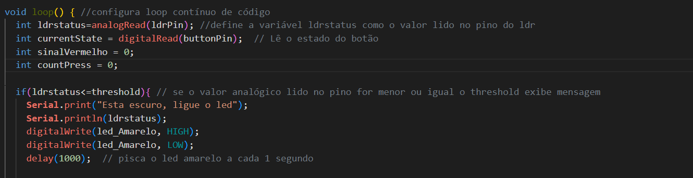
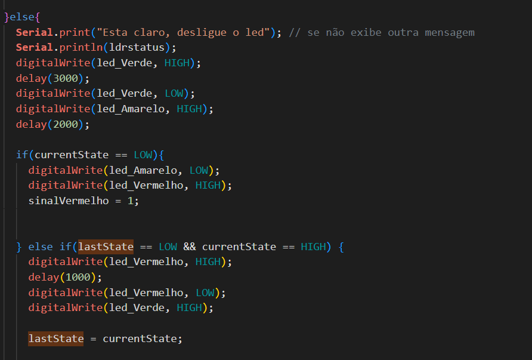
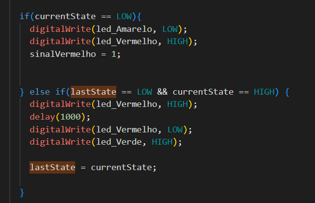
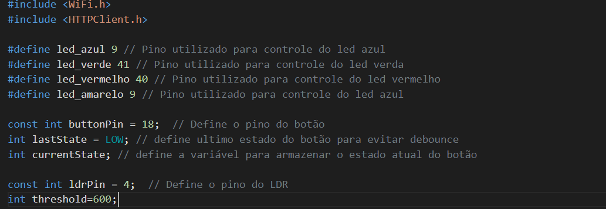
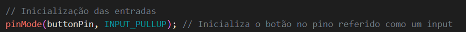
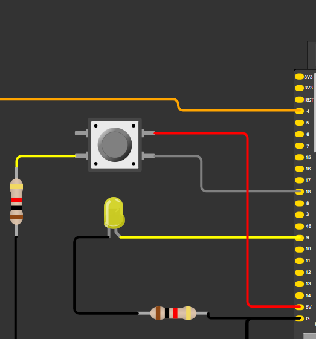
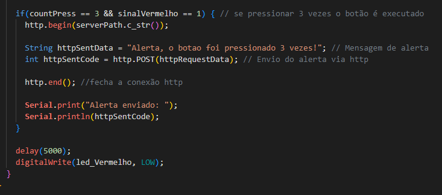

# Prova-IOT-Parte-2 - Autor: Ian Pereira Simão

## Etapas do projeto:

### 1 - Padronização do código:
O código foi revisado na íntegra e apresenta comentários todos padronizados em português, além disso, nesta etapa aproveitei para arrumar a conexão do led que não me parecia correta.

### 3 - Declaração de entradas e saídas:
Nesta etapa todas as saídas e entradas do projeto foram declaradas corretamente, observei que apenas uma não havia sido explicitamente declarada, a do Led amarelo, junto dela também adicionei o botão em pull-up como estava definido no diagrama que encontrei online, a fim de evitar variações eletromagnéticas que fossem atrapalahar o funcionamento futuramente.

### 4 - Definição da lógica dos leds

Nesta etapa do código adiciono a lógica para ligar o led caso o valor deinifido no threshold for maior ou igual ao valor lido pelo LDR

### 5 - Definição de ciclo padrão do semáforo

Aqui é definido o funcionamento padrão do semáforo com ciclos de tempo predefinidos. Salvo que após esta etapa algumas outras foram aplicadas nas linhas posteriores.

### 6 - adição de botão que quando clicado abre o sinal
 

 aqui já foi definida a funcionalidade do botão, levando em conta posteriormente o pedido de uso de pullDown para evitar interferências.

### 7 - Suporte à debounce
nesta etapa houveram duas correções, uma de código e outra das ligações do circuito em si.

#### 1° - código:

 
Adicionei as variáveis para definir os estados do botão.
 
 

Configurei o botão para ficar em pullup

#### 2° - circuito:

Verifiquei que o botão estava ligado na entrada RST que se trata do "reset" ou reinicio do esp32, liguei-o na entrada de 5 volts.

### 8 - Aviso ao pressionar botão
Neste etapa tive certa dificuldade, devido minhas implementações anteriores não consegui implementar millis(), minha ideia era que a cada clique mesmo que estivesse outro código rodando de maneira assíncrona ele salvasse +1 clique na variável countPress, assim que o loop saísse da parte do sinal vermelho eu idealiava que a contagem voltasse à zero.

Apesar disso implementei o envio da mensagem por protocolo http, utilizei a mesma variável demonstrada anteriormente de modo à enviar a mensagem `"Alerta, o botao foi pressionado 3 vezes!"`.